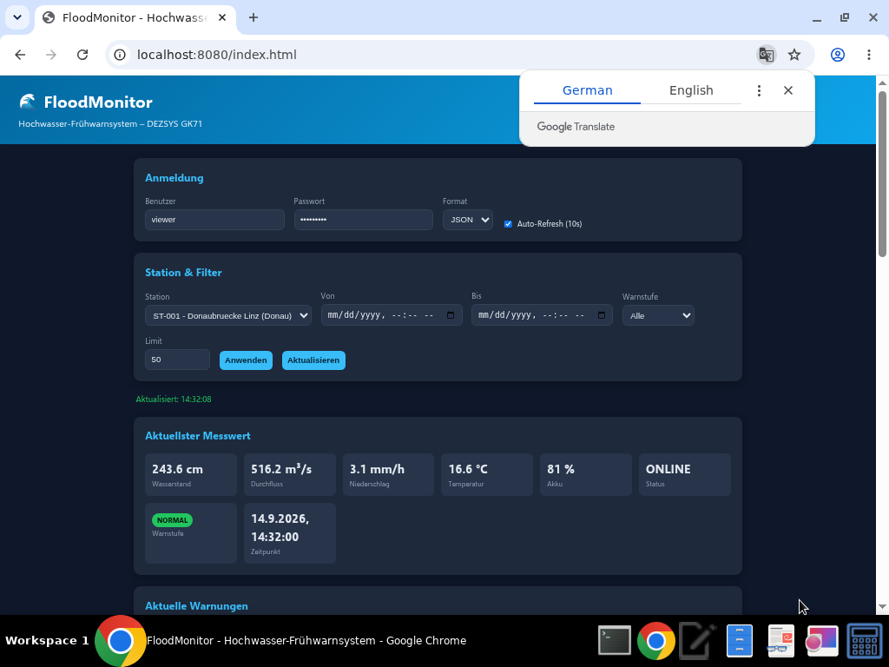
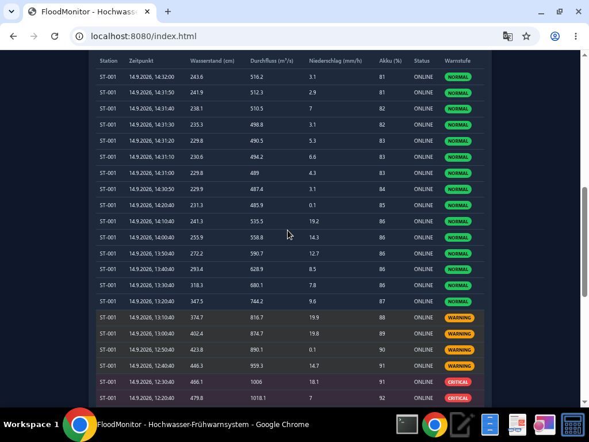

# DEZSYS_GK71_FLOODMONITOR_REST

Hochwasser-Fr&uuml;hwarnsystem mit REST-Schnittstelle, Content Negotiation (JSON/XML),
serverseitiger Datensimulation, Webclient (HTML/CSS/jQuery), Fehlerbehandlung, Caching (ETag) und OpenAPI-Dokumentation.

> Umsetzung der Aufgabe *DEZSYS GK71 &ndash; FloodMonitor REST* mit **Java 17**,
> **Spring Boot 3.2** und **Gradle**.

---

## Inhaltsverzeichnis

1. [Projektbeschreibung](#projektbeschreibung)
2. [Technologie-Stack](#technologie-stack)
3. [Schnellstart](#schnellstart)
4. [Konfiguration](#konfiguration)
5. [Architektur](#architektur)
6. [Datenmodell](#datenmodell)
7. [Simulationsregeln](#simulationsregeln)
8. [Warnstufenberechnung](#warnstufenberechnung)
9. [REST-API](#rest-api)
10. [Content Negotiation (JSON & XML)](#content-negotiation-json--xml)
11. [Beispiele (curl)](#beispiele-curl)
12. [Fehlerbehandlung](#fehlerbehandlung)
13. [Caching mit ETag](#caching-mit-etag)
14. [Webclient](#webclient)
15. [Tests](#tests)
16. [OpenAPI / Swagger](#openapi--swagger)
17. [Projektstruktur](#projektstruktur)
19. [Reflexion](#reflexion)

---

## Projektbeschreibung

Entlang eines Flusses befinden sich mehrere Messstationen. Jede aktive Station
erzeugt in konfigurierbaren Intervallen realistische, zusammenh&auml;ngende
Messwerte (Wasserstand, Durchflussmenge, Niederschlag, Temperatur, Akkustand).
Die Daten werden &uuml;ber eine REST-Schnittstelle als **JSON** oder **XML**
bereitgestellt. Neben aktuellen Messwerten stehen historische Daten,
Warnmeldungen und statistische Auswertungen zur Verf&uuml;gung. Ein Webclient
visualisiert die Daten und erlaubt das Filtern nach Station, Zeitraum und
Warnstufe.

## Technologie-Stack

- Java 17, Spring Boot 3.2 (Spring Web, Validation, Actuator)
- Jackson (JSON) + `jackson-dataformat-xml` (XML)
- Gradle (inkl. Gradle Wrapper)
- springdoc-openapi (Swagger UI)
- JUnit 5, Spring MockMvc, spring-security-test

## Schnellstart

Voraussetzung: **JDK 17**. Gradle wird &uuml;ber den Wrapper mitgeliefert.

```bash
# Anwendung starten
./gradlew bootRun

# oder: bauen und als JAR ausfuehren
./gradlew build
java -jar build/libs/floodmonitor-rest-1.0.0.jar
```

Die Anwendung l&auml;uft anschlie&szlig;end unter **http://localhost:8080**.

- Webclient: <http://localhost:8080/index.html>
- Swagger UI: <http://localhost:8080/swagger-ui.html>

Standard-Zugangsdaten (nur f&uuml;r lokale Entwicklung, siehe
[Konfiguration](#konfiguration)):

||--|
| VIEWER | `viewer` | `viewer123`|
| ADMIN  | `admin`  | `admin123` |

## Konfiguration

Zentrale Einstellungen in `src/main/resources/application.properties`:

| Property | Bedeutung | Standard |
|---|---|---|
| `server.port` | Port des Servers | `8080` |
| `simulation.interval` | Intervall der Messwerterzeugung (ms) | `10000` |
| `simulation.enabled` | Simulation aktiv | `true` |
| `simulation.seed-history` | vorbef&uuml;llte Messwerte pro Station | `30` |
| `floodmonitor.security.*` | Zugangsdaten (Platzhalter) | siehe Datei |

**Geheime Zugangsdaten geh&ouml;ren nicht ins Git-Repository.** Die Passw&ouml;rter
werden &uuml;ber Umgebungsvariablen oder eine lokale, nicht versionierte Datei
gesetzt:

## Architektur

Die Anwendung ist in klar getrennte Schichten unterteilt (Controller enthalten
keine umfangreiche Gesch&auml;ftslogik):

```
controller/   REST-Endpunkte (HTTP)         -> delegiert an Services
service/      Gesch&auml;ftslogik, Simulation, Warnstufe, Statistik
repository/   In-Memory-Datenhaltung (Map/List)
model/        Datenklassen und Enums
dto/          Anfrage-/Antwortobjekte (Wrapper fuer JSON/XML)
exception/    zentrale Fehlerbehandlung (@RestControllerAdvice)
config/       Content Negotiation, OpenAPI
```

```
Client (Webclient / curl)
        |  HTTP (JSON | XML)
        v
   Controller  ->  Service  ->  Repository (In-Memory)
        ^              |
        |          SimulatorService (@Scheduled) erzeugt Messwerte
   @RestControllerAdvice (einheitliche ApiError-Antworten)
```

## Datenmodell

**Station**: `id`, `name`, `river`, `location` (lat/lon), `normalWaterLevel`,
`warningWaterLevel`, `criticalWaterLevel`, `active`.

**Measurement**: `stationId`, `timestamp` (ISO-8601, `java.time.Instant`),
`waterLevel` (cm), `flowRate` (m&sup3;/s), `rainfall` (mm/h), `temperature`
(&deg;C), `batteryLevel` (%), `status`, `warningLevel`.

**Enums**:
- `WarningLevel`: `NORMAL`, `WARNING`, `CRITICAL`, `UNKNOWN`
- `StationStatus`: `ONLINE`, `MAINTENANCE`, `OFFLINE`

**ApiError**: `timestamp`, `status`, `error`, `message`, `path`.

## Simulationsregeln

Der `SimulatorService` erzeugt f&uuml;r jede **aktive** Station regelm&auml;&szlig;ig
neue Messwerte. Umgesetzte Regeln:

- Wasserst&auml;nde sind niemals negativ.
- Der Akkustand liegt zwischen 0 und 100 % und sinkt langsam.
- Starker Niederschlag erh&ouml;ht den Wasserstand tendenziell.
- Ein h&ouml;herer Wasserstand f&uuml;hrt zu h&ouml;herer Durchflussmenge
  (`flowRate ~= waterLevel * 2,1 + rainfall * 1,5`).
- Der neue Wasserstand basiert auf dem vorherigen Wert (sanfte &Uuml;berg&auml;nge,
  keine rein zuf&auml;lligen Spr&uuml;nge).
- Bei sehr niedrigem Akkustand (&lt; 15 %) wechselt der Status auf `MAINTENANCE`.
- F&uuml;r deaktivierte Stationen werden **keine** Messwerte erzeugt.

Beim Start werden deterministische historische Messwerte erzeugt (Sinusverlauf
&uuml;ber alle Warnstufen), damit sofort Daten vorhanden sind und Tests **nicht
zuf&auml;llig** fehlschlagen. In Tests ist die laufende Simulation deaktiviert
(`simulation.enabled=false`).

## Warnstufenberechnung

Die Warnstufe wird **serverseitig** berechnet (`WarningLevelService`) und kann
vom Client nicht vorgegeben werden:

| Bedingung | Warnstufe |
|---|---|
| Wasserstand &lt; `warningWaterLevel` | `NORMAL` |
| `warningWaterLevel` &le; Wasserstand &lt; `criticalWaterLevel` | `WARNING` |
| Wasserstand &ge; `criticalWaterLevel` | `CRITICAL` |
| keine g&uuml;ltige Messung / Station | `UNKNOWN` |

## REST-API

Basis-URL: `/api/v1`

### Verpflichtende Endpunkte

| Methode | Endpunkt | Beschreibung |
|---|---|---|
| `GET` | `/api/v1/stations` | Alle Stationen (Filter: `river`, `active`, `warningLevel`) |
| `GET` | `/api/v1/stations/{id}` | Einzelne Station |
| `GET` | `/api/v1/stations/{id}/measurements/latest` | Aktuellster Messwert (mit ETag) |
| `GET` | `/api/v1/stations/{id}/measurements` | Historie (Filter: `from`, `to`, `limit`, `warningLevel`) |
| `GET` | `/api/v1/alerts` | Aktuelle Warnungen (Filter: `warningLevel`, `river`) |
| `GET` | `/api/v1/stations/{id}/statistics` | Statistik einer Station |

### Administrative Endpunkte

| Methode | Endpunkt | Beschreibung |
|---|---|---|
| `POST` | `/api/v1/stations` | Station anlegen (201) |
| `PATCH` | `/api/v1/stations/{id}` | Station teilweise &auml;ndern (auch `active`) |
| `DELETE` | `/api/v1/stations/{id}` | Station l&ouml;schen (204) |

Validierung: `criticalWaterLevel` muss gr&ouml;&szlig;er als `warningWaterLevel`
sein (409 bei doppelter ID, 400 bei ung&uuml;ltigen Werten).

Die Statistik enth&auml;lt: `minWaterLevel`, `maxWaterLevel`, `avgWaterLevel`,
`avgFlowRate`, `totalRainfall`, `measurementCount`, `warningCount`,
`criticalCount`.

## Content Negotiation (JSON & XML)

- Ohne `Accept`-Header wird **JSON** geliefert.
- `Accept: application/json` &rarr; JSON, `Accept: application/xml` &rarr; XML.
- Optional per Query-Parameter: `?format=json` bzw. `?format=xml`.
- Nicht unterst&uuml;tzte Formate &rarr; **406 Not Acceptable**.

JSON und XML enthalten dieselben fachlichen Informationen.

## Beispiele (curl)

```bash
# Alle Stationen als JSON
curl -u viewer:viewer123 -H "Accept: application/json" \
  http://localhost:8080/api/v1/stations

# Alle Stationen als XML
curl -u viewer:viewer123 -H "Accept: application/xml" \
  http://localhost:8080/api/v1/stations

# Aktuellster Messwert (XML)
curl -u viewer:viewer123 -H "Accept: application/xml" \
  http://localhost:8080/api/v1/stations/ST-001/measurements/latest

# Historie gefiltert nach Zeitraum und Limit
curl -u viewer:viewer123 \
  "http://localhost:8080/api/v1/stations/ST-001/measurements?from=2026-01-01T00:00:00Z&to=2100-01-01T00:00:00Z&limit=50"

# Nur kritische Warnungen
curl -u viewer:viewer123 \
  "http://localhost:8080/api/v1/alerts?warningLevel=CRITICAL"

# Statistik
curl -u viewer:viewer123 \
  http://localhost:8080/api/v1/stations/ST-001/statistics

# Station anlegen (nur ADMIN)
curl -X POST -H "Content-Type: application/json" \
  -d '{"id":"ST-010","name":"Neue Station","river":"Salzach",
       "location":{"latitude":47.8,"longitude":13.0},
       "normalWaterLevel":100,"warningWaterLevel":200,"criticalWaterLevel":300}' \
  http://localhost:8080/api/v1/stations
```

Beispiel einer XML-Antwort (`latest`):

```xml
<measurement>
  <stationId>ST-001</stationId>
  <timestamp>2026-05-01T10:15:00Z</timestamp>
  <waterLevel>318.4</waterLevel>
  <flowRate>742.6</flowRate>
  <rainfall>12.7</rainfall>
  <temperature>14.3</temperature>
  <batteryLevel>87</batteryLevel>
  <status>ONLINE</status>
  <warningLevel>WARNING</warningLevel>
</measurement>
```

## Fehlerbehandlung

Zentrale Behandlung mit `@RestControllerAdvice`. Fehler werden einheitlich als
`ApiError` (JSON **oder** XML) zur&uuml;ckgegeben &ndash; ohne Stacktraces.

| Situation | Status |
|---|---|
| Erfolg | 200 / 201 / 204 |
| Ung&uuml;ltige Eingabe (`from` nach `to`, ung&uuml;ltige/negative/zu gro&szlig;e `limit`, ung&uuml;ltiges Datum, ung&uuml;ltige Warnstufe) | 400 |
| Anmeldung erforderlich | 401 |
| Zugriff nicht erlaubt (falsche Rolle) | 403 |
| Station nicht gefunden | 404 |
| Format nicht unterst&uuml;tzt | 406 |
| Konflikt (ID existiert bereits) | 409 |
| Medientyp nicht unterst&uuml;tzt | 415 |
| Interner Fehler | 500 |

## Caching mit ETag

Der Endpunkt `.../measurements/latest` liefert einen `ETag`:

```
ETag: "measurement-ST-001-1746094500"
```

Sendet der Client bei einer sp&auml;teren Anfrage `If-None-Match` mit demselben
Wert und hat sich die Ressource nicht ge&auml;ndert, antwortet der Server mit
**304 Not Modified** (ohne Body). Bei vielen Clients spart dies Bandbreite und
Rechenzeit, da unver&auml;nderte Daten nicht erneut &uuml;bertragen werden.

## Webclient

Der Webclient (`src/main/resources/static/`, HTML + CSS + jQuery) bietet:

- Auswahl der Station per Dropdown,
- Anzeige des aktuellsten Messwerts,
- tabellarische Historie (Station, Zeitpunkt, Wasserstand, Durchfluss,
  Niederschlag, Akku, Status, Warnstufe),
- Filter nach Zeitraum, Warnstufe und Limit,
- Umschaltung zwischen **JSON** und **XML** (der Client wertet XML aus),
- automatische Aktualisierung alle 10 Sekunden,
- Lade- und Fehlermeldungen,
- Farbcodierung: `NORMAL` gr&uuml;n, `WARNING` orange, `CRITICAL` rot,
  `UNKNOWN` grau.

### Screenshots





## Tests

25 automatisierte Tests (JUnit 5 + MockMvc), u. a. alle in der Aufgabe
geforderten Szenarien:

1. Alle Stationen als JSON
2. Alle Stationen als XML
3. Existierende Station
4. Unbekannte Station (404)
5. Aktuellster Messwert
6. Filterung nach Zeitraum
7. Ung&uuml;ltiger Zeitraum (`from` nach `to`)
8. Warnstufe `NORMAL`
9. Warnstufe `WARNING`
10. Warnstufe `CRITICAL`
11. Nicht unterst&uuml;tztes Format (406)
12. Maximales / g&uuml;ltiges Limit

Zusätzlich: negatives Limit, ungültige Warnstufe, ungültiges Datumsformat, Statistik, Warnungen, POST/PATCH/DELETE, ungültige Schwellwerte, Fehler als XML.

```bash
./gradlew test
```

Die Simulation ist w&auml;hrend der Tests deaktiviert; deterministische
Seed-Daten sorgen f&uuml;r reproduzierbare Ergebnisse.

## OpenAPI / Swagger

Die API ist mit OpenAPI dokumentiert:

- Swagger UI: <http://localhost:8080/swagger-ui.html>
- OpenAPI-JSON: <http://localhost:8080/v3/api-docs>

## Projektstruktur

```
DEZSYS_GK71_FLOODMONITOR_REST/
+- build.gradle / settings.gradle / gradlew(.bat)
+- src/main/java/at/htl/floodmonitor/
|  +- FloodMonitorApplication.java
|  +- model/        Station, Location, Measurement, WarningLevel,
|  |                StationStatus, ApiError, StationStatistics
|  +- dto/          Create/Update-Requests, List-Response-Wrapper
|  +- repository/   StationRepository, MeasurementRepository
|  +- service/      StationService, MeasurementService,
|  |                SimulatorService, WarningLevelService
|  +- controller/   StationController, MeasurementController, AlertController
|  +- exception/    GlobalExceptionHandler + Custom-Exceptions
|  +- config/       SecurityConfig, WebConfig, OpenApiConfig
+- src/main/resources/
|  +- application.properties
|  +- static/       index.html, css/style.css, js/app.js
+- src/test/java/... Integrationstests
+- docs/screenshots/ Screenshots des Webclients
```

## Reflexion

**Aufgetretene Themen & L&ouml;sungen:**

- *Content Negotiation f&uuml;r Listen:* Standardm&auml;&szlig;ig erzeugt Jackson
  XML wenig sprechende Wurzelelemente f&uuml;r Listen. Gel&ouml;st durch dedizierte
  Wrapper-DTOs (`StationListResponse`, `MeasurementListResponse`,
  `AlertListResponse`) mit `@JacksonXmlElementWrapper`/`@JacksonXmlProperty`.
- *Reproduzierbare Tests trotz Simulation:* Die laufende Simulation ist in Tests
  deaktiviert; beim Start werden deterministische Seed-Messwerte erzeugt, die
  alle Warnstufen abdecken &ndash; dadurch keine zuf&auml;lligen Fehlschl&auml;ge.
